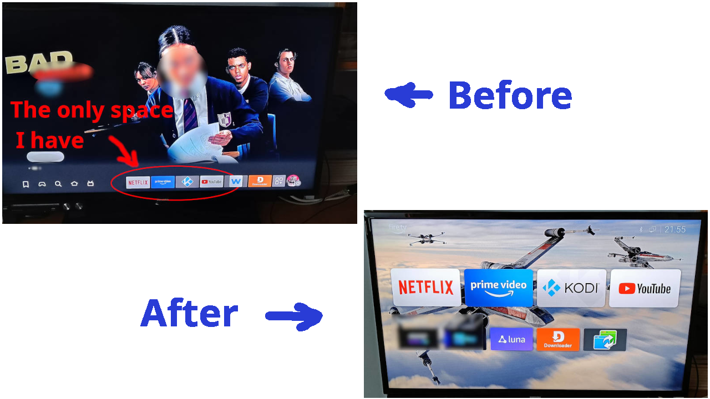
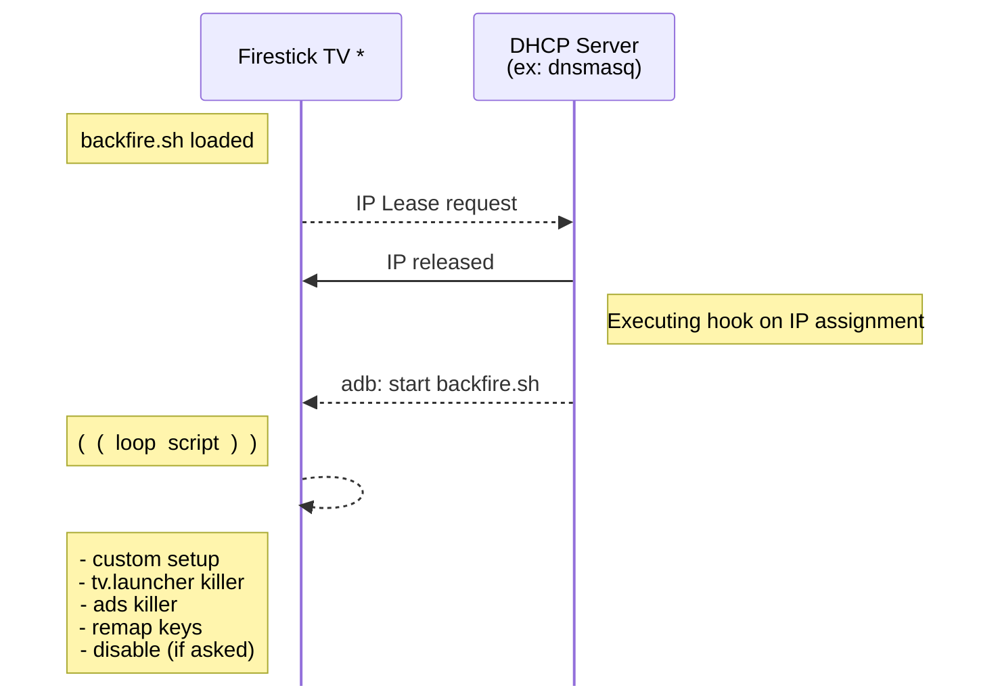

# BackFireTV &nbsp; &nbsp;

**Take back control of _Your_ Firestick.**  
Tired of Ads, a cluttered launcher, and buttons you can't change? BackFireTV is
a project to liberate your Firestick from Amazon's walled garden and make it *truly* yours.  
They call it the **fire**stick. To fight fire with fire, you need a **backfire**.

That's the soul of **BackFireTV**. To truly liberate it and return back to its core capabilities
this project uses a linux script, one Android app and ADB access against Amazon's restrictive
policies. We leverage these internal tools to create a "backfire" against the incessant ads and
locked ecosystem, transforming your Firestick back into the useful, customizable device it was
always meant to be.

---

## The Problem

The Amazon Firestick starts as an excellent, affordable streaming device. However, Amazon's
aggressive Ad policies and restrictive ecosystem have turned it into an increasingly annoying
and a less useful device. It comes with frustrations:
- **Messy interface**. The less the better was probably the best slogan for the early device,
its interface is now cluttered and chaotic when you probably need just a couple of buttons
for starting your favorite applications.
- **Constant Ads**. The default launcher is filled with commercials and sponsored content.
- **Bloated Interface**. A cluttered and slow home screen you can't customize.
- **Locked Buttons**. Dedicated buttons for services you don't use (like popular streaming
providers) that can't be easily changed.
- **Lack of Control**. A closed ecosystem that limits what you can do.

I could overlook them all if the device was provided for free. But since you pay and you own
it it should be legit to do whatever you please in your personal device and network.

## The Solution: BackFireTV
BackFireTV hacks your Firestick to give you back control. It uses a clever system of DHCP hooks
and ADB (Android Debug Bridge) commands to remotely manage your device, block annoyances and
customize your experience from the moment it connects to your network.  
The dhcp lease action starts a nohup command on the firestick and forgets about it, the daemon
then manages running programs, hacks remote control features and keys. It can be paused or
resumed, no rooting required.

### Features
- **Autosetup on boot**. Always start your custom launcher on boot, it doesn't matter
if it was previously disabled from remote (or black listed). The daemon takes care of substituting default 
launcher with yours (linux layer approach).
- **Custom Launcher**. Automatically replaces the default Amazon launcher with the lean and clean
[Wolf Launcher](https://www.google.com/search?q=wolf+launcher).
- **Ad-Free Experience:**. Blocks annoying ads and sponsored content for a cleaner interface.
- **Button Remapping**. Reprogram the physical buttons on your remote. For example, make the
**Disney+** button launch **Kodi** or your favorite application.
- **Works on every firestick 4K**. Tested on: Firestick TV 4k (1st/2nd gen), Firestick TV 4k Max.
- **No rooting required**. It runs on basic user permissions with standard privileges. It
also works on standard devices: latest firmware, with or without external hw attached 
(usb storage, network cards, usb hubs, ...).
- **No banned apps**. This hack relies on the linux subsystem underneath, no matter what Amazon
does on the AppStore, this script can always be sideloaded and cannot be banned (no fingerprints
on android app layer).
- **Toggle to default anytime**. Standard amazon launcher can still be toggled any time for
administrative tasks or just as a comparison. Feel free to manage it as usual and switch back to 
kiosk mode once done.
- **1+1+1 = A script to rule them all**. 1 script (on the firestick), 1 hook (on dhcp server), 
1 app (Android) [opt] to toggle between Ads-Free and Standard mode.

### Before & After: Reclaim Your Screen
When it's free I'm fine with Ads. If I'm paying for it (as I did) I'll do whatever I want because it's _mine_.  
That's what happens automatically at boot without human intervention

### How It Works
BackFireTV uses a simple but powerful automated workflow. At its core, it's a "set-and-forget"
system that ensures your Firestick is always configured the way *you* want it, every time it
connects to your network.

### Installation
This solution consists of:
- **daemon script**. Installed at the linux level, it captures android events, deals with hw, remote control
keys and network URLs. One script, no dependencies, just follow the [installation procedure](./installation.md)
- **dhcp hook**. Available in the dhcp [`examples/`](./examples/) directory. Configuration is different for each
daemon. I already included **dnsmasq** because it's a common choice for small lan installations. 
I'd like to add **djb**, **bind** as well as many others. Feel free to create a PR or ask for it through
[project issues](../../issues)
- **android launcher toggler**. 1 line (literally) android _.apk_ app. When executed it toggles between
**custom** and **default** launcher modes. If you want to disable the daemon and perform normal operations
like: being fed by ADS, install apps, tinker with settings and so on this app switches between launchers.
    - [APK binary available](https://github.com/andreabenini/android/blob/main/projects/adbLauncherToggler/app/release/app-release.apk)
        - Install it with [Downloader](https://www.amazon.com/AFTVnews-com-Downloader/dp/B01N0BP507)
        - or manually with adb tools, like:
        `adb -s <ipAddress>:5555 install /path/to/your/app.apk`
    - [Source code and android studio project](https://github.com/andreabenini/android/tree/main/projects/adbLauncherToggler) available too

---
## Free your Firestick. Reclaim your screen.
...and contribute + support this project if you have time :)  
> **Disclaimer:** This is a hacking PoC project. While it's designed to be safe, you are modifying your device at your own risk.
This project is intended for educational purposes and for use in a controlled environment (yours).
